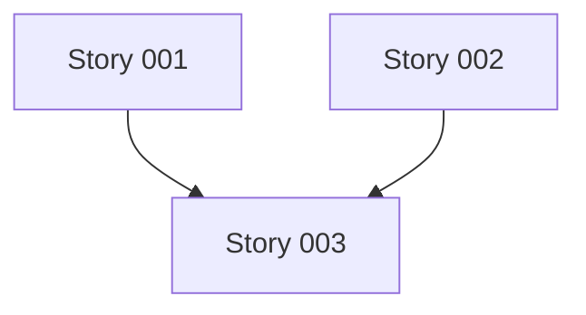

<objective>
Generate user stories from epic, each story following INVEST criteria and ready for technical spec creation.
</objective>

<required_reading>
- templates/story.md - Story file structure
- references/story-patterns.md - INVEST examples
</required_reading>

<process>

## Step 1: Read Epic and References

1. Read the epic file provided by user
2. Read templates/story.md
3. Read references/story-patterns.md

## Step 2: Extract Story Candidates

From the epic, identify:
1. **In-scope features** - What's explicitly included
2. **User personas** - Who will interact with this
3. **User workflows** - What sequences of actions users will take
4. **Acceptance criteria** - What "done" means for the epic

Break the epic into story-sized pieces (each completable in 1-5 days).

## Step 3: Apply INVEST Criteria

For each story candidate, verify:
- **Independent**: Can be built without waiting for other stories
- **Negotiable**: Implementation details flexible
- **Valuable**: Delivers user or business value on its own
- **Estimable**: Clear enough to size
- **Small**: Fits in a sprint (1-5 days)
- **Testable**: Has measurable acceptance criteria

If story fails INVEST, split or refine it.

## Step 4: Write Story Files

For each story:

1. **Determine story number**
   - Check .workflow/stories/ for existing stories
   - Use next sequential number (001, 002, etc.)

2. **Create filename**
   - Format: `story-{number}-{slug}.md`
   - Example: `story-001-user-signup.md`

3. **Use template** from templates/story.md

4. **Fill sections:**
   - User story statement ("As a... I want... so that...")
   - Acceptance criteria (Given/When/Then format)
   - Business value justification
   - Technical considerations
   - Dependencies (if any)
   - Link to parent epic

5. **Write file** to .workflow/stories/

## Step 5: Create Story Index

Create `.workflow/stories/EPIC-{number}-STORIES.md`:

```markdown
# Stories for Epic {Number}: {Epic Title}

Source epic: .workflow/epics/epic-{number}-{slug}.md
Generated: {date}
Total stories: {count}

## Stories

### Story {number}: {Title}
**As a:** {persona}
**I want:** {capability}
**Value:** {benefit}
**Status:** Ready for spec

### Story {number}: {Title}
...

## Story Dependencies



## Recommended Order

1. Story {number} (no dependencies, foundational)
2. Story {number} (depends on: {numbers})
3. Story {number} (depends on: {numbers})

## Next Steps

Run `/spec-story .workflow/stories/story-{number}-{slug}.md` to create technical spec.
```

## Step 6: Validate Stories

For each story, check:
- [ ] Follows INVEST criteria
- [ ] Has clear acceptance criteria
- [ ] Links to parent epic
- [ ] Has business value stated
- [ ] Is small enough (1-5 days)
- [ ] Is testable

If validation fails, refine the story.

</process>

<output_specification>
Creates:
- .workflow/stories/story-{number}-{slug}.md (multiple)
- .workflow/stories/EPIC-{number}-STORIES.md (index)

Each story file contains:
- YAML frontmatter (story_id, epic_id, title, status)
- User story statement
- Acceptance criteria
- Business value
- Technical notes
- Dependencies
- Metadata (source epic, created date)
</output_specification>

<success_criteria>
Complete when:
1. All story files written to .workflow/stories/
2. Story index created
3. INVEST validation passes for all stories
4. User informed of next step (/spec-story)
</success_criteria>
