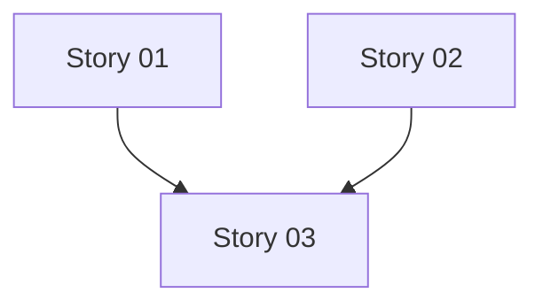

<objective>
Generate user stories from epic, each story following INVEST criteria and ready for technical spec creation.
Stories are organized in epic-specific subdirectories with identifier propagation.
</objective>

<required_reading>
- templates/story.md - Story file structure
- references/story-patterns.md - INVEST examples
- ../storyline-epic-creator/references/identifier-system.md - Identifier extraction
</required_reading>

<process>

## Step 1: Read Epic and References

1. Read the epic file provided by user
2. Read templates/story.md
3. Read references/story-patterns.md

## Step 2: Extract Identifier and Epic ID

**From epic filename:** (e.g., `epic-mco-1234-01-auth.md`)

Parse to extract:
- Identifier: `mco-1234` (or empty if format is `epic-001-auth.md`)
- Epic number: `01` or `001`
- Epic ID: `mco-1234-01` or `001`

**From epic frontmatter:**
- Read `identifier` field (if present)
- Read `epic_id` field
- Read `epic_number` field

Use frontmatter as source of truth if available; fall back to filename parsing.

## Step 3: Extract Story Candidates

From the epic, identify:
1. **In-scope features** - What's explicitly included
2. **User personas** - Who will interact with this
3. **User workflows** - What sequences of actions users will take
4. **Acceptance criteria** - What "done" means for the epic

Break the epic into story-sized pieces (each completable in 1-5 days).

## Step 3: Apply INVEST Criteria

For each story candidate, verify:
- **Independent**: Can be built without waiting for other stories
- **Negotiable**: Implementation details flexible
- **Valuable**: Delivers user or business value on its own
- **Estimable**: Clear enough to size
- **Small**: Fits in a sprint (1-5 days)
- **Testable**: Has measurable acceptance criteria

If story fails INVEST, split or refine it.

## Step 5: Create Epic Subdirectory

**Create directory for this epic's stories:**

```bash
mkdir -p .workflow/stories/epic-{epic_id}/
```

Examples:
- With identifier: `.workflow/stories/epic-mco-1234-01/`
- Without identifier: `.workflow/stories/epic-001/`

## Step 6: Write Story Files

For each story:

1. **Determine story number**
   - Simple sequential: 01, 02, 03, etc. (2 digits)
   - Start from 01 for each epic

2. **Create filename in epic subdirectory**
   - Format: `story-{nn}.md`
   - Example: `story-01.md`, `story-02.md`, `story-03.md`
   - Full path: `.workflow/stories/epic-{epic_id}/story-{nn}.md`

3. **Use template** from templates/story.md

4. **Fill sections:**
   - Story ID: `01`, `02`, etc.
   - Epic ID: `{epic_id}` (e.g., `mco-1234-01` or `001`)
   - Identifier: `{identifier}` (if present, else omit field)
   - User story statement ("As a... I want... so that...")
   - Acceptance criteria (Given/When/Then format)
   - Business value justification
   - Technical considerations
   - Dependencies (if any)
   - Link to parent epic (relative path: `../../epics/epic-{epic_id}-{slug}.md`)

5. **Write file** to `.workflow/stories/epic-{epic_id}/`

## Step 7: Create Story Index

Create `.workflow/stories/epic-{epic_id}/INDEX.md`:

```markdown
# Stories for Epic {epic_id}: {Epic Title}

Source epic: ../../epics/epic-{epic_id}-{slug}.md
{Identifier: {identifier}}  # If present
Generated: {date}
Total stories: {count}

## Stories

### Story 01: {Title}
**As a:** {persona}
**I want:** {capability}
**Value:** {benefit}
**Status:** Ready for spec
**File:** [story-01.md](story-01.md)

### Story 02: {Title}
...

## Story Dependencies



## Recommended Order

1. Story 01 (no dependencies, foundational)
2. Story 02 (depends on: 01)
3. Story 03 (depends on: 01, 02)

## Next Steps

Run `/sl-spec-story .workflow/stories/epic-{epic_id}/story-01.md` to create technical spec.
```

**Index location:** `.workflow/stories/epic-{epic_id}/INDEX.md` (inside epic directory)

## Step 6: Validate Stories

For each story, check:
- [ ] Follows INVEST criteria
- [ ] Has clear acceptance criteria
- [ ] Links to parent epic
- [ ] Has business value stated
- [ ] Is small enough (1-5 days)
- [ ] Is testable

If validation fails, refine the story.

</process>

<output_specification>
Creates:
**With identifier:**
- .workflow/stories/epic-{identifier}-{nn}/ (directory)
- .workflow/stories/epic-{identifier}-{nn}/story-01.md
- .workflow/stories/epic-{identifier}-{nn}/story-02.md
- .workflow/stories/epic-{identifier}-{nn}/story-0N.md
- .workflow/stories/epic-{identifier}-{nn}/INDEX.md

**Without identifier:**
- .workflow/stories/epic-{nnn}/ (directory)
- .workflow/stories/epic-{nnn}/story-01.md
- .workflow/stories/epic-{nnn}/story-02.md
- .workflow/stories/epic-{nnn}/story-0N.md
- .workflow/stories/epic-{nnn}/INDEX.md

Each story file contains:
- YAML frontmatter (story_id, epic_id, identifier (if present), title, status)
- User story statement
- Acceptance criteria
- Business value
- Technical notes
- Dependencies
- Traceability (parent epic link)
- Metadata (created date)
</output_specification>

<success_criteria>
Complete when:
1. All story files written to .workflow/stories/
2. Story index created
3. INVEST validation passes for all stories
4. User informed of next step (/sl-spec-story)
</success_criteria>
